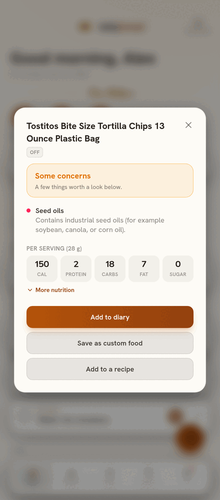

# dailybread

A self-hosted life-planning app for families. Daily routines, to-dos, a shared
schedule, and food tracking in one place, running entirely on hardware you
control.

<p>
  
  
  
  
  
</p>

The screens show a fictional family; none of it is real data.

## Status

In daily use by a real family, and in active development.

## What it does

- A family board that knows what time it is: routines, tasks, activities, and
  appointments (one-off or repeating, like a weekly work meeting), with
  recurrence, multiple assignees, streaks, a member filter, and a List or
  Timeline view of the day. A calendar keeps honest day-by-day history.
- Real phone notifications: reminders shortly before anything timed (with a
  configurable lead, and a longer runway for appointments), an optional morning
  digest and evening check-in, and family-activity pushes you tune per kind. A
  reminder that would have fired while the server was down still catches up for
  a short window. Standard Web Push with encrypted payloads, so the server
  needs no inbound exposure. An in-app Inbox keeps a history of family activity
  even when pushes are off.
- Nutrition: a private per-member food diary (barcodes, custom foods, and
  search by name once you add a free USDA API key),
  recipes with computed per-serving nutrition, a weight log and health profile
  that auto-adjust a daily calorie target, and an exercise log that earns
  calories back. A finished day can be locked, and any food can be pinned to a
  saved-foods shelf for quick logging.
- Barcode Health Check: an adult-only "Scan a food" button in the masthead on
  every tab. Scan a packaged food's barcode (or type the code) and the app
  checks the label against the same OpenFoodFacts and USDA lookups it already
  uses, then shows a verdict from Whole food down to Highly processed with
  severity-sorted flags: seed and hydrogenated oils, artificial sweeteners and
  dyes, common preservatives, high sodium, added sugar, ultra-processed NOVA
  marks, and more, alongside per-serving nutrition. A thin label reads Limited
  data instead of pretending the food is clean. From a result you can add the
  food to your diary, save it as a custom food, or add it to a recipe.
- Health: your own phone pushes fitness data to your server (Apple Health or
  Health Connect), and nothing is ever fetched from a cloud service. The Health
  tab shows daily steps, active calories, and distance with time-of-day
  charts, exercise minutes, workouts with route maps, resting heart rate, and
  weight and body-fat trends. Each member tunes their own daily targets for
  steps, active energy, and exercise minutes.
- The Kitchen: per-store grocery lists, a recipe box, and a week of planned
  dinners that surface on the board. Each night takes one of four standing modes
  (self-serve, homemade, go out, delivery); the family votes, kids included, and
  a parent locks in the pick.
- Breadcrumbs: light gamification for showing up. Members earn crumbs for daily
  verses, locked diary days, workouts, and kids' completed cards, climbing
  levels and bread-themed tiers. There are deliberately no purchases and no
  public leaderboard.
- Daily verses: an opt-in verse of the day (bundled NKJV text, so it phones home
  to no one) with reading streaks worn as a small badge beside the avatar.
- Family accounts with parent and child roles. Child accounts are simplified
  and parent-supervised: no nutrition or calorie data at all, a narrowed board,
  check-offs that wait for approval, and a mood, status, and journal only
  parents see. Kids can still cast their dinner vote.
- Villages: private circles of linked families, invitation-only and
  undiscoverable, for sharing across households without any social-media
  mechanics. Families share recipes and custom foods, and share events with
  per-family RSVPs that land on each attending family's board in their own
  timezone. No feed, no likes, ever.
- Onboarding by invite code: the server admin mints a short-lived code; the
  invitee picks their own username and password and founds their own family,
  and the admin gets a notification when they arrive. A server overview lists
  every family, village and member on the install, with the controls to remove
  a household, rename or dissolve a village, remove a member, and reset any
  account's password.
- Per-member themes, daily moods rendered as weather, and a private journal.

## Privacy

Your data stays on your server. The app keeps no cloud account, sends no
telemetry, and makes no third-party calls except optional online food lookups
you turn on yourself. Health and fitness data arrives because your own phone
pushes it to your server; nothing fitness-related is fetched from an outside
service (see [docs/fitness-sync.md](docs/fitness-sync.md)). See
[PRIVACY.md](PRIVACY.md).

## Tech

- Backend: FastAPI (Python) and PostgreSQL.
- Frontend: React (Vite, TypeScript), Tailwind CSS, and Framer Motion, built as
  a Progressive Web App.
- Runs with Docker Compose.

## How it is meant to be run

There are two separate things, and they share only this source code. No real
data or secrets move between them.

1. This repository: the code.
2. Your own private instance: where you and your family actually use it, on your
   own network.

Step-by-step instructions for standing up your own instance are in
[docs/self-hosting.md](docs/self-hosting.md).

## Repository layout

```
backend/           FastAPI service
frontend/          React PWA
docs/              architecture, self-hosting and fitness-sync guides
docs/screenshots/  the images used in this README
.github/           CI workflow
```

## Development

```
cp .env.example .env     # then edit values
docker compose up        # starts database, backend, and frontend
```

Compose publishes the app at `127.0.0.1:8080` (the nginx frontend, which
proxies `/api` to the backend) and the backend separately at `127.0.0.1:8000`
for development. You use the app through `8080` alone.

Backend tests: `cd backend && python -m pytest`. Frontend build:
`cd frontend && npm run build`. CI runs both on every push to `main` and on
every pull request, along with `ruff check`. The backend carries a large pytest
suite (750 backend tests), while the frontend is type-checked with tsc and
built in CI, with UI changes verified manually.

## Built with AI assistance

I build this project with the help of Claude, Anthropic's AI assistant. It
contributes to the code, architecture, and documentation. I direct the work,
review it, and decide what ships.

## About

dailybread is built and maintained by [Lazarus Labs](https://lazaruslabsllc.com).

## License

GNU AGPL-3.0. See [LICENSE](LICENSE). Copyright (c) 2026 Lazarus Labs LLC.

In plain terms: run it, modify it, and self-host it freely. If you host a
modified version for other people, you must share your modifications under
the same license.

One carve-out: the daily verse text in `frontend/src/lib/verses.ts` is quoted
from the New King James Version and is not covered by the AGPL.
Scripture taken from the New King James Version&reg;. Copyright &copy; 1982 by
Thomas Nelson. Used by permission. All rights reserved. Quoted under the
publisher's gratis use policy (fewer than 500 verses, comprising a small
fraction of this work).
